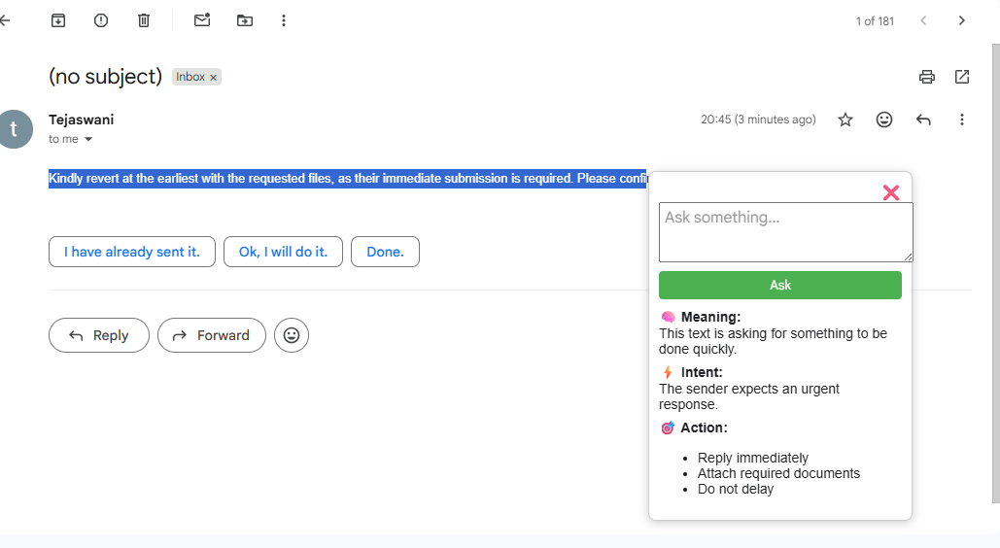

# 🚀 Clarity – Instant Context & Action Assistant

## 💡 What is Clarity?
Clarity is a Chrome extension that doesn't just explain what you read —  
it tells you what it means and what you should do next.

---

## 🎯 Problem
While browsing emails, articles, or study material:
- You understand words but miss intent  
- You don’t know what action to take  
- You waste time figuring “what next?”  

---

## 💡 Solution
Clarity gives instant:

- 🧠 Meaning → simple explanation  
- ⚡ Intent → what it actually means  
- 🎯 Action → what you should do next  

All in one click.

---

## ⚡ How it Works
1. Highlight any text  
2. Click **Clarity button**  
3. Click **Ask**  
4. Get structured output instantly  

---

## ✨ Features
- Works on any website  
- Clean popup interface  
- Action-oriented insights (not just explanation)  
- Fast and lightweight  

---

## 📸 Demo Preview

---

## ⚙️ Installation
1. Download this repo  
2. Open Chrome → `chrome://extensions/`  
3. Enable Developer Mode  
4. Click **Load Unpacked**  
5. Select this folder  

---

## 🛠️ Tech Stack
- JavaScript  
- HTML  
- CSS  
- Chrome Extension APIs  

---
## 🔮 Future Enhancements

Clarity is designed to evolve into a fully AI-powered assistant.

In future versions, we plan to:
- Integrate advanced AI models for real-time, personalized insights  
- Provide smarter, context-aware action suggestions  
- Adapt responses based on user behavior and preferences  
- Support multiple domains like emails, education, and productivity workflows  

Our goal is to make Clarity a true decision-making assistant, not just a text helper.

---

## 🚀 Vision
To turn passive reading into actionable understanding.
